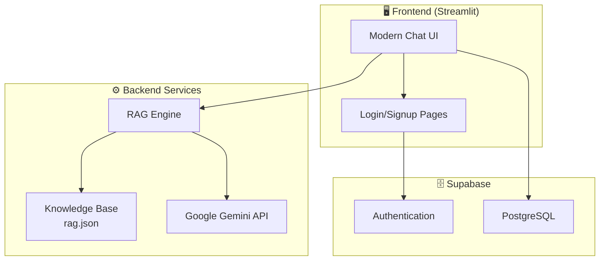
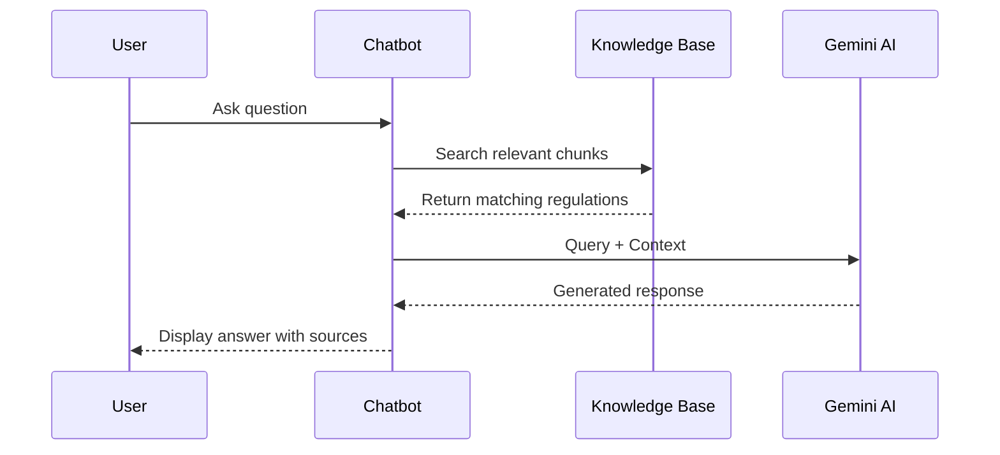

# 🎓 Exam Explainer Bot

An **AI-powered chatbot** that helps students understand examination and evaluation processes using **Retrieval-Augmented Generation (RAG)** with **Google Gemini AI**.

> Built for SRKR Engineering College - R23 Regulations

---

## 🌟 Features

| Feature | Description |
|---------|-------------|
| 🤖 **AI-Powered Responses** | Uses Google Gemini 1.5 for intelligent, contextual answers |
| 📚 **RAG Knowledge Base** | Retrieves accurate information from official regulations |
| 🔐 **Secure Authentication** | Supabase-powered user login and signup |
| 💬 **Chat History** | Persistent conversation storage per user |
| 🌍 **Multi-language** | Supports English, Hindi, and Telugu responses |
| 🎨 **Modern UI** | Beautiful ChatGPT-style interface with animations |

---

## 🏗️ System Architecture



---

## 🛠️ Tech Stack

| Layer | Technology |
|-------|------------|
| **Frontend** | Streamlit, Custom CSS |
| **AI/ML** | Google Gemini 1.5 Flash |
| **RAG** | JSON-based knowledge retrieval |
| **Authentication** | Supabase Auth |
| **Database** | Supabase PostgreSQL |
| **Language** | Python 3.10+ |

---

## 📁 Project Structure

```
exam-explainer-bot/
├── app.py              # Main Streamlit application
├── gemini_client.py    # Google Gemini API wrapper
├── rag.py              # Retrieval-Augmented Generation
├── knowledge_base.py   # Knowledge base management
├── auth.py             # Supabase authentication
├── database.py         # Database operations
├── analytics.py        # Usage analytics
├── prompts.py          # System prompts & templates
├── rag.json            # Knowledge base (R23 regulations)
├── requirements.txt    # Python dependencies
├── .env                # Environment variables (private)
└── README.md           # This file
```

---

## 🚀 Quick Start

### Prerequisites
- Python 3.10+
- Google AI API Key
- Supabase Account (optional, for auth)

### Installation

```bash
# Clone the repository
git clone https://github.com/Manoj-ruler/Exam_Explainer.git
cd Exam_Explainer

# Create virtual environment
python -m venv .venv
.venv\Scripts\activate  # Windows
# source .venv/bin/activate  # Linux/Mac

# Install dependencies
pip install -r requirements.txt
```

### Configuration

Create a `.env` file:

```env
GOOGLE_API_KEY=your_gemini_api_key_here
SUPABASE_URL=your_supabase_url
SUPABASE_ANON_KEY=your_supabase_anon_key
```

### Run the Application

```bash
streamlit run app.py
```

Open `http://localhost:8501` in your browser.

---

## 📖 How RAG Works



### RAG Pipeline:
1. **Query Processing** - User question is analyzed
2. **Retrieval** - Relevant chunks from `rag.json` are matched
3. **Augmentation** - Context is injected into the prompt
4. **Generation** - Gemini generates accurate response

---

## 📊 Knowledge Base

The `rag.json` contains **27 document chunks** covering:

- ✅ Grading System (10-point scale)
- ✅ Attendance Requirements (75% minimum)
- ✅ Internal & External Evaluation
- ✅ Revaluation Process
- ✅ Credit System (160 total credits)
- ✅ Internship Requirements
- ✅ MOOC Policies
- ✅ Malpractice Regulations
- ✅ Promotion Rules

---

## 🎨 UI Screenshots

| Login Page | Chat Interface |
|------------|----------------|
| Modern gradient login with Supabase auth | Clean ChatGPT-style conversation |

| Welcome Screen | Knowledge Base |
|----------------|----------------|
| Animated mascot with quick actions | 27 regulation chunks loaded |

---

## 🔑 Key Modules

### `gemini_client.py`
Handles all interactions with Google Gemini API:
- Chat session management
- Response generation
- Error handling

### `rag.py`
Implements RAG pipeline:
- Context retrieval from `rag.json`
- Prompt augmentation
- Source citation formatting

### `knowledge_base.py`
Manages the knowledge base:
- Loads `rag.json` on startup
- Keyword-based document matching
- Returns relevant context for queries

---

## 📈 Future Enhancements

- [ ] Vector embeddings with pgvector
- [ ] PDF upload for custom documents
- [ ] Voice input/output
- [ ] Admin dashboard
- [ ] Analytics dashboard

---

## 👥 Team

| Role | Name |
|------|------|
| Developer | Manoj Kumar |
| Institution | SRKR Engineering College |
| Regulation | R23 (2023-24 batch) |

---

## 📄 License

This project is for educational purposes.

---

## 🙏 Acknowledgments

- Google Gemini AI
- Streamlit Community
- Supabase
- SRKR Engineering College

---

<div align="center">

**Made with ❤️ using Streamlit & Gemini AI**

[⭐ Star this repo](https://github.com/Manoj-ruler/Exam_Explainer) | [🐛 Report Bug](https://github.com/Manoj-ruler/Exam_Explainer/issues)

</div>
